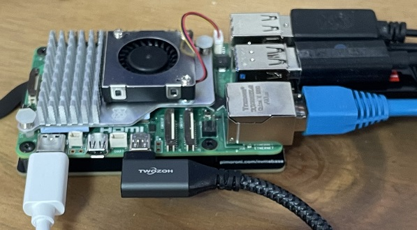
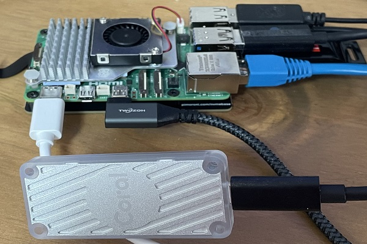
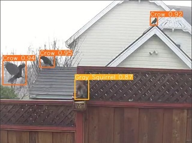

# Yolov8_Rpi5_CoralUSB
Install and Test of Yolov8 on Raspberry Pi5 with USB Coral TPU

<br>
<div style="text-align: center;">
  
</div>
<br>

<br>
To just install yolov8 on Raspberry Pi5 with TPU simply type:

```shell
sudo apt-get update
sudo apt-get upgrade -y
sudo apt-get autoremove -y
python3 -m venv yolo_env
source yolo_env/bin/activate
pip3 install ultralytics
```
<br>
There is also a shell scrip available for download, which includes the same lines above and the additional download of the GardenCam vodeos and models plus test runs: 

```shell
wget https://github.com/StefansAI/Yolov8_Rpi5_CoralUSB/raw/main/scripts/yolov8_install.sh
chmod +x yolov8_install.sh
./yolov8_install.sh
```
<br>

<br>
============================================================================
<br>

<br>
<div style="text-align: center;">
  
</div>
<br>

<br>
To run the Coral TPU with the Raspberry Pi 5 I had to research a lot, since nothing was straight forward. One reason is, that Google stopped supporting their software support for their TPU long time ago. But Python has evolved and the old Google installations don't work anymore. 
<br>
I mainly followed this article: <a href="https://docs.ultralytics.com/guides/coral-edge-tpu-on-raspberry-pi/">Coral Edge TPU on a Raspberry Pi with Ultralytics YOLOv8</a>, but also <a href="https://github.com/JungLearnBot/RPi5_yolov8/blob/main/Readme.RPi5.coral_tpu.picam.qt.md">JungLearnBot/RPi5_yolov8/Coral_TPU</a> and of course <a href="https://coral.ai/docs/accelerator/get-started/">Get started with the USB Accelerator</a>.
<br>

It took me some time, where I could not get any exported model to run on the TPU at all. Finally, after some debugging, I had to find out, that there is an implicit name convention mentioned nowhere. Here is the export as recommended: 
```shell 
yolo export model=yolov8n.pt format=edgetpu
```
Despite the format= edgetpu, this export function creates file names like this for instance:
```shell
yolov8n_integer_quant.tflite
```
But this will never be directed to the TPU. To run it on the TPU, it has to have a name with "**_edgetpu.tflite**" in the name, like 
```shell
yolov8n_integer_quant_edgetpu.tflite
```
So, you'll have to rename all exported files or make a copy to that name to compare both.
I tried to follow this article and also installed the  <a href="https://github.com/DAVIDNYARKO123/edge-tpu-silva">edge_tpu_silva</a>-version in a python 3.9 venv for comparison. Overall, both installation test results were the same and disappointing. There is a speed increase from *.pt models to *.tflite models through the optimization, but no difference between CPU and TPU execution. For 640 size the TPU execution even exceeded the CPU time.
<br>
|Image Size|Model|RPi5-CPU/TPU|RPi5-Execution|Jetson Nano Execution|
|:--------:|----:|:----------:|:------------:|:-------------------:|
|640|*.pt|CPU|385.2ms|64.4ms|
||*int8.ftlite|CPU|380.3ms||
||*int8_edgetpu.ftlite|TPU|383.3ms||
|320|*.pt|CPU|110.5ms|38.5ms|
||*int8.ftlite|CPU|68.4ms||
||*int8_edgetpu.ftlite|TPU|68.2ms||
|224|*.pt|CPU|64.9ms|37.9ms|
||*int8.ftlite|CPU|27.6ms||
||*int8_edgetpu.ftlite|TPU|27.7ms||
<br>

To verify that the edgetpu version is really executed on the TPU, I unplugged the USB cable and observed the USB transfer error and the immediate abortion of the execution. The non-edgetpu model kept running when unplugging, so it must have been executed on the CPU only.
<br>
<br>
To verify the results and install yolov8 plus USB Coral TPU, download an run the script:

```shell
wget https://github.com/StefansAI/Yolov8_Rpi5_CoralUSB/raw/main/scripts/yolov8_coral_install.sh
chmod +x yolov8_coral_install.sh
./yolov8_coral_install.sh
```

<br>
This script performs the installation, performs the exports of the yolo models and copying to "_edgetpu.tflite" versions. At the end of the script, the GardenCam videos and the GardenCam models are downloaded to demo the installation for few seconds each. The average python code then calculates the average exeution times for each run and displays the results.

<br>
<div style="text-align: center;">
  
</div>
<br>
