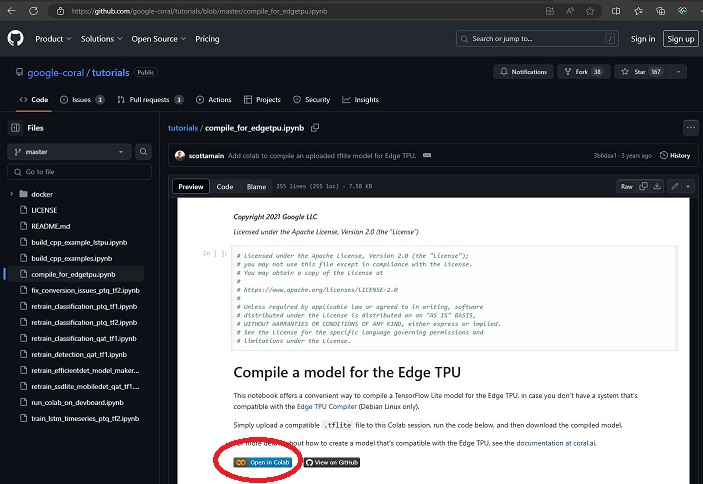
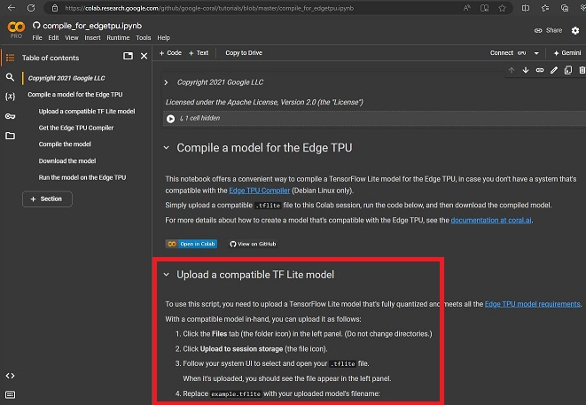
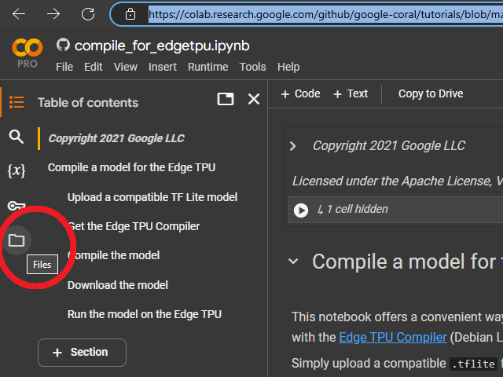
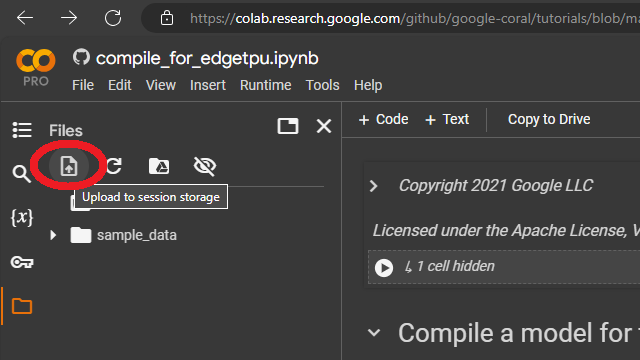
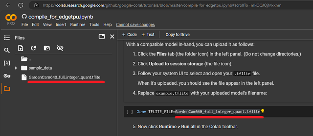
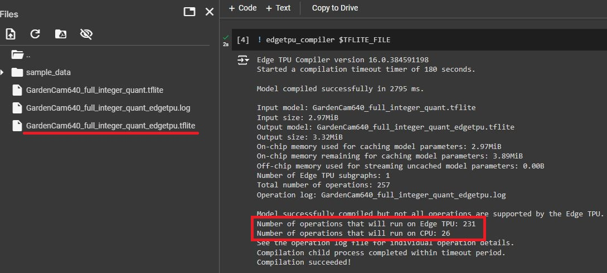

# Yolov8_Rpi5_CoralUSB
Install and Test of Yolov8 on Raspberry Pi5 with USB Coral TPU

<br>
<div style="text-align: center;">
  
</div>
<br>

<br>
To just install yolov8 on Raspberry Pi5 with TPU simply type:

```shell
sudo apt-get update
sudo apt-get upgrade -y
sudo apt-get autoremove -y
python3 -m venv yolo_env
source yolo_env/bin/activate
pip3 install ultralytics
```
<br>
There is also a shell scrip available for download, which includes the same lines above and the additional download of the GardenCam vodeos and models plus test runs: 

```shell
wget https://github.com/StefansAI/Yolov8_Rpi5_CoralUSB/raw/main/scripts/yolov8_install.sh
chmod +x yolov8_install.sh
./yolov8_install.sh
```
<br>

<br>
============================================================================
<br>

<br>
<div style="text-align: center;">
  
</div>
<br>

<br>
To run the Coral TPU with the Raspberry Pi 5 I had to research a lot, since nothing was straight forward. One reason is, that Google stopped supporting their software support for their TPU long time ago. But Python has evolved and the old Google installations don't work anymore. 
<br>
I mainly followed this article: <a href="https://docs.ultralytics.com/guides/coral-edge-tpu-on-raspberry-pi/">Coral Edge TPU on a Raspberry Pi with Ultralytics YOLOv8</a>, but also <a href="https://github.com/JungLearnBot/RPi5_yolov8/blob/main/Readme.RPi5.coral_tpu.picam.qt.md">JungLearnBot/RPi5_yolov8/Coral_TPU</a> and of course <a href="https://coral.ai/docs/accelerator/get-started/">Get started with the USB Accelerator</a>.<br>
In addition I tried to follow the Ultralytics article and in addition installed the  <a href="https://github.com/DAVIDNYARKO123/edge-tpu-silva">edge_tpu_silva</a>-version in a python 3.9 venv for comparison.
<br>

It took me some time, where I could not get any exported model to run on the TPU at all. Finally, after some debugging, I had to find out, that there is an implicit name convention. Here is the yolo export as recommended: 
```shell 
yolo export model=yolov8n.pt format=edgetpu
```
Despite the format=edgetpu, this export function creates file names like this for instance:
```shell
yolov8n_integer_quant.tflite
```
But this will never be directed to the TPU. To run it on the TPU, it has to have a name with "**_edgetpu.tflite**" in the name, like 
```shell
yolov8n_integer_quant_edgetpu.tflite
```
The missing link is the edge tpu compiler. But when you try to install this compiler on the Raspberry Pi as described here: <a href="https://coral.ai/docs/edgetpu/compiler/#system-requirements">Edge TPU Compiler</a>, the installation fails. There are examples, where the compiler was made available for the Pi: <a href="https://github.com/FearL0rd/edgetpu_compiler_for_ARM64">Edgetpu compiler for ARM64</a>. However, trying it out I got an error message "Internal compiler error. Aborting!", something was missing. <br>
The path, that worked well in the end was compiling in Colab instead. There is a github repository with a Jupyter notebook: <a href="https://github.com/google-coral/tutorials/blob/master/compile_for_edgetpu.ipynb">Compile for Edge TPU</a>. 
<br>
<div style="text-align: center;">
  
</div>
<br>
Clicking on the "Open in Colab" button will get will you to Colab.
<br>
<div style="text-align: center;">
  
</div>
<br>
To compile a file, just follow the description. Click on the file icon on the left.
<br>
<div style="text-align: center;">
  
</div>
<br>
The hit the upload icon, navigate to the location on your local machine and select the .tflite file to upload.
<br>
<div style="text-align: center;">
  
</div>
<br>
Then enter the file name into the code cell and hit "Run All" from the "Runtime" menu item.
<br>
<div style="text-align: center;">
  
</div>
<br>
Check the compiler output for results to see that there are operations assigned to the TPU. The compiler output file will be downloaded automatically to the Download folder of the local machine.
<br>
<div style="text-align: center;">
  
</div>
<br>

Here is my summary of all test runs. The CPU only results are coming from the "*.tflite" models and the TPU results from the "*_edgetpu.tflite" models:
|Image Size|Model|RPi5-CPU|RPi5-CPU+TPU|Jetson Nano Execution|
|:--------:|:----|:------:|:----------:|:-------------------:|
|640|*.pt|385.2ms||64.4ms|
||\*full_integer_quant\*|361.0ms|77.4ms||
||\*integer_quant\*|360.2ms|73.2ms||
||\*int8\*|380.3ms|383.3ms||
||||||
|320|*.pt|110.5ms||38.5ms|
||\*full_integer_quant\*|84.7ms|17.4ms||
||\*integer_quant\*|83.6ms|16.9ms||
||\*int8\*|68.4ms|68.2ms||
||||||
|224|*.pt|64.9ms||37.9ms|
||\*full_integer_quant\*|43.2ms|11.1ms||
||\*integer_quant\*|43.0ms|10.7ms||
||\*int8\*|27.6ms|27.7ms||
<br>

Interestingly, the Jetson Nano wins with larger image sizes. But the RPi-Coral combinations catches up and is running away at smaller sizes. This will make this combination more suitable for smaller image robotics applications.<br>
Originally I also assumed that the int8 model would be the fastest and most compact version to work with. But that isn't true at all from my observations. The compiler output stated:

```python
Number of operations that will run on Edge TPU: 0
Number of operations that will run on CPU: 254
```
There might be some better solution for int8, but this was my result. I also noticed a drop in accuracy with int8, which is related to the low resolution of int8.<br>
In the end, the best results in accuracy are coming from the fully quantized integer version. It makes sense to only concentrate on that one.
<br>
<br>
<br>
To verify the results and install yolov8 plus USB Coral TPU, download an run the script:

```shell
wget https://github.com/StefansAI/Yolov8_Rpi5_CoralUSB/raw/main/scripts/yolov8_coral_install.sh
chmod +x yolov8_coral_install.sh
./yolov8_coral_install.sh
```

<br>
This script performs the installation, performs the exports of the yolo models and copying to "_edgetpu.tflite" versions. At the end of the script, the GardenCam videos and the GardenCam models are downloaded to demo the installation for few seconds each. The average python code then calculates the average exeution times for each run and displays the results.

<br>
<div style="text-align: center;">
  
</div>
<br>
